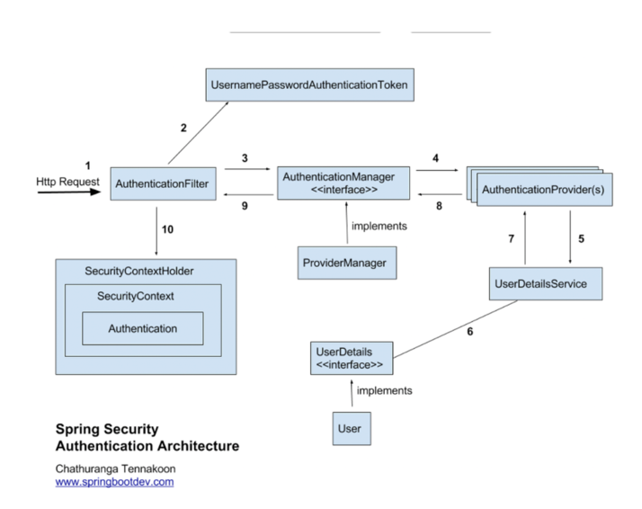

# AuthenticationFilter

실행 순서를 이야기처럼 해보겠다.



1. Http Request가 들어왔을 때 인증을 해줘야하면 UsernamePasswordAuthenticationFilter이 동작함
2. Token을 만든다 (id, password가 들어있겠지)
3. ProviderManager에게 Token이 들어왔는데 처리할 수 있냐고 물어봄
4. Manager는 Provider들을 가지고있고 for문을 돌려가며 처리할 수 있는 애를 찾는다.
5. 중요 ! Provider는 UserDetailsService한테 ID만 넘긴다.
6. UserDetailsService는 UserDetails를 가지고있고
7. UserDetailsService에 해당하는 아이디가 존재하면 UserDetails를 넘김
8. UserDetail과 Token값이 같으면 성공 아니면 실패

이게 인증의 끝 다음에 요청이 들어오면 getAuthentication으로 가져오면 된다.

우리가 갈아치울 부분은 UserDetailsService이다.

## DetailsService 구현
이름을 받고 UserDetails를 DetailsService를 DB로 바꿔보겠다.

### DetailsService
```java

@Service
@RequiredArgsConstructor
public class CustomDetailService implements UserDetailsService {
    
    private final MemberService memberService;
    
    @Override
    public UserDetails loadUserByUsername(String username) throws UsernameNotFoundException {
        Member member = memberService.getUser(username);
        return new AcademyUser(member);
    }
}

```

MemberService는 Redis를 사용하여 만들었다.
### AcademyUser

```java
public class AcademyUser implements UserDetails {
    private String name;
    private String password;
    private Role role;

    public AcademyUser(Member member) {     
        name = member.getId();
        password = member.getPassword();
        role = member.getRole();
    }

    @Override
    public Collection<? extends GrantedAuthority> getAuthorities() {
        String role = "ROLE_" + this.role;
        return Arrays.asList(new SimpleGrantedAuthority(role));
    }

    @Override
    public String getPassword() {
        return password;
    }

    @Override
    public String getUsername() {
        return this.name;
    }
}

```

이 UserDetails가 Provider에게 넘어가서 맞는지 확인

