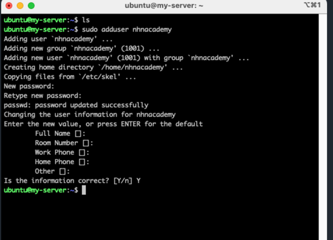

# 서버 준비

1. ubuntu 환경의 서버를 준비한다.

2. 보안그룹 22번 포트를 연다
   ssh 설정을 위해

이때 pair key를 생성했다면 pem 파일이 있는 위치에서

```
sudo ssh -i chosun.pem ubuntu@{ip 주소}
```

주의! sudo했을 경우 비밀번호는 내 컴퓨터의 비밀번호이다.

접속이 가능해진다.

3. 계정을 하나 만든다.
root 계정에서
```shell
sudo adduser nhnacademy
```
비밀 번호 입력하고 엔터 다 누르기

full name 부터 optional임




4. 계정용  RSA 키 만들기

RSA

public 키 -> 서버
private 키 -> 개인이

5. nhnacademy 계정으로 로그인

```shell
sudo login nhnacademy

```

6. key 만들기

```shell
mkdir keygen
cd keygen
ssh-keygen -t rsa -f ./github_rsa

#모두 enter

cat github_rsa

```


구조가 authorized_keys에 저 공개키를 넣어두면 
개인키를 가지고 있는 사람들이 접속 가능함. 

7. ssh key 설정하기

~/.ssh/authorized_keys 파일에 github_rsa.pub 을 추가함.

```shell
mkdir ~/.ssh
chmod 700 ~/.ssh
cp ~/keygen/github_rsa.pub ~/.ssh/authorized_keys
chmod 644 ~/.ssh/authorized_keys
```

주의할점 ! 

chmod 700 즉 자기 자신만 읽고 , 쓰고, 실행할 수 있는 권한을 가짐 지금 nhnacademy임


8. 서버 접속하기

서버를 켜두고 다른 컴퓨터로 github_rsa 즉 개인키를 가지고 접속을 시도해야함

권한이 자기 자신만 읽을 수 있게 해야함 400

```shell
sudo ssh -i github_rsa nhnacademy@{서버 주소}
```

접속이 완료될것임

### 주의할 점

파일의 주인이 누구인지 잘 생각해서 권한을 잘 줄것 


