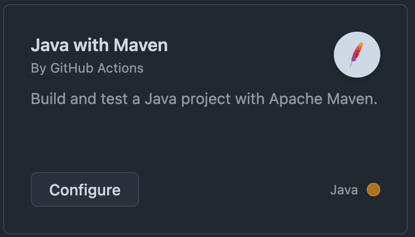

# git action 만들기



github -> actions -> java with maven 


## code

```shell

name: Java CI with Maven

on:
  push:
    branches: [ "main" ]
  pull_request:
    branches: [ "main" ]

jobs:
  build:

    runs-on: ubuntu-latest

    steps:
    - uses: actions/checkout@v3
    - name: Set up JDK 11
      uses: actions/setup-java@v3
      with:
        java-version: '11'
        distribution: 'temurin'
        cache: maven
    - name: Build with Maven
      run: mvn -B package --file pom.xml

    # Optional: Uploads the full dependency graph to GitHub to improve the quality of Dependabot alerts this repository can receive
    - name: Update dependency graph
      uses: advanced-security/maven-dependency-submission-action@571e99aab1055c2e71a1e2309b9691de18d6b7d6
      
```


## 환경 변수 등록하기

```shell
SSH_ID  : nhnacademy
SSH_IP  : 133.186.250.247
SSH_KEY :  private key, github_rsa
SSH_PORT : 22
```

## mvn package 후 파일 업로드

```shell
- name : upload file
      uses: appleboy/scp-action@master
      with:
        host: ${{ secrets.SSH_IP }}
        username: ${{ secrets.SSH_ID }}
        key: ${{ secrets.SSH_KEY }}
        port: ${{ secrets.SSH_PORT }}
        source: "target/*.jar"
        target: "~/"
        rm: false
```

## upload 된 jar파일을 실행

```shell
 - name: execute shell script
      uses: appleboy/ssh-action@master
      with:
        host: ${{ secrets.SSH_IP }}
        username: ${{ secrets.SSH_ID }}
        key: ${{ secrets.SSH_KEY }}
        port: ${{ secrets.SSH_PORT }}
        script_stop: true
        script: "./startup.sh"
```

## 서버에서 스크립트 작성

```shell
vi ~/startup.sh

#아래 shell script를 생성하고 저장 합니다.
/usr/local/java/java11/bin/java -Dserver.port=8080  -jar ~/target/hello.jar > log   2>&1 &

#권한 755 설정
chmod 755 ~/startup.sh
```

주의할점 !! 

이때 action에 사용한 유저네임과 script를 작성한 유저가 같아야함!!

root로 되어있다면 확인바람


## sonar qube

sonar qube

```shell
mvn sonar:sonar \
-Dsonar.projectKey=hello-spring \
-Dsonar.host.url=http://123:456:789:9999 \
-Dsonar.login={toekn}
```

Action -> repository secret

```shell
SONAR_HOST : {ip}
SONAR_TOKEN : {토큰}
```


maven.yml
```shell
    - name : Run SonarQube
      run : mvn sonar:sonar -Dsonar.projectKey=github-action -Dsonar.host.url=${{secrets.SONAR_HOST}} -Dsonar.login=${{secrets.SONAR_TOKEN}}
```


## 참고할것

https://docs.github.com/ko/actions/writing-workflows/quickstart

깃허브 액션 공식ㅂ문서임 


