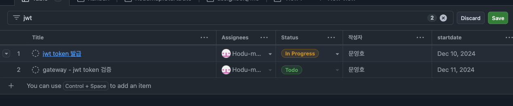
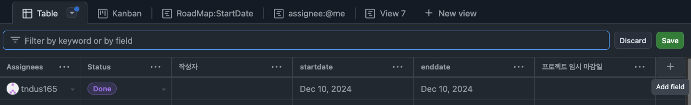
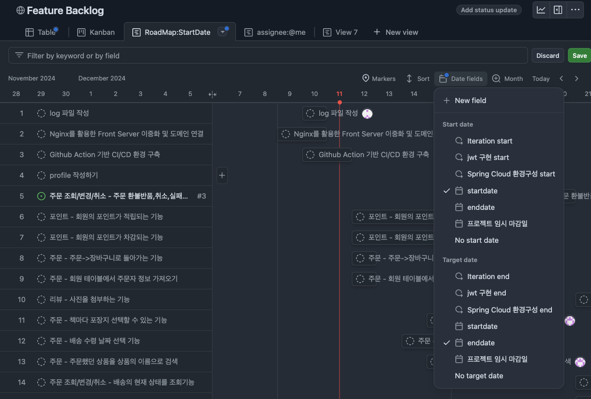
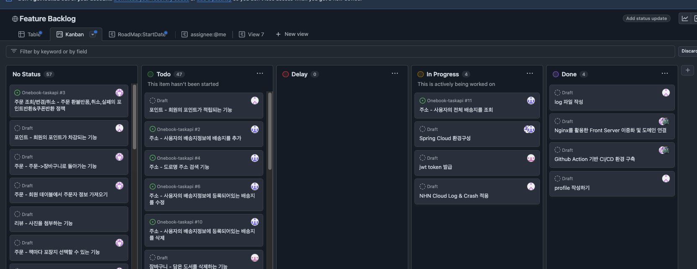

# github projects

Github organization에서 일정 관리를 할 때 projects를 쓴다.

여기서 팀원들의 일정을 맞출 수 있고

개발할 것들이 뭐뭐 있는지 백로그를 작성해서 시간을 정할 수 있다.

프로젝트를 할 때 중요한건 시간관리이다. 

자신이 뭘 해야하는지 알 수 있다면 편할것이다.

## 로드맵에서 시간 지정하는법 

저런식으로 백로그를 만들어두고 

add field 한 후 date 타입으로 startdate, enddate를 만든 후

만든 백로그에 시작 시간과, 끝나는 시간을 정한다.

그 후 roadmap에서 date fields를 시작시간과 끝나는 시간을 지정해주면 된다. 

## Kanban Delay

칸반 보드에서 딜레이 된것도 이렇게 해놓으면 뭐가 딜레이 됐는지 보고 

스크럼 마스터를 통해 일정을 조정할 수 있다. 

> pm (project manager) : 전체적인 프로젝트 관리, client 만나는일함
> pl (project leader) : 기술적인 문제를 해결 