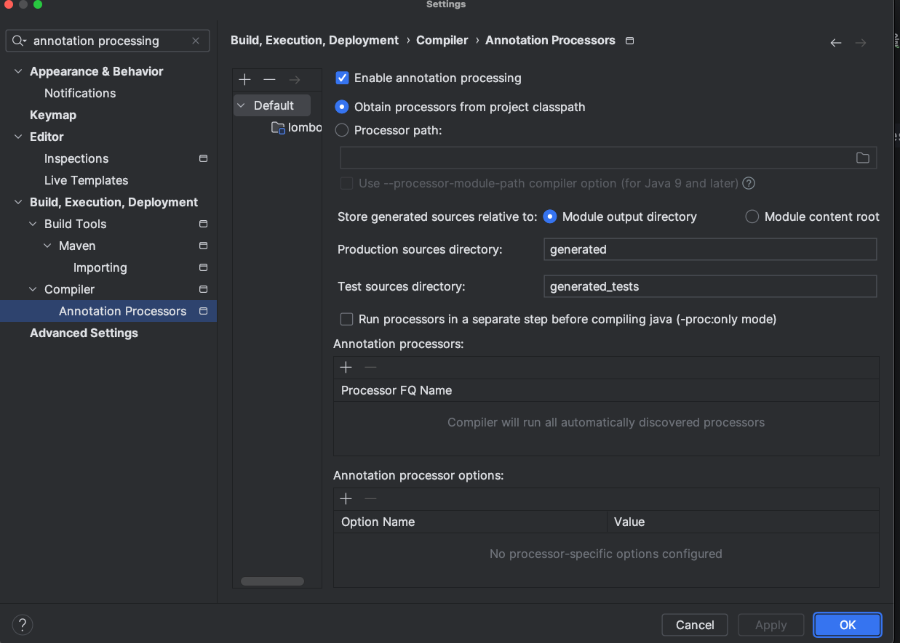

# lombok can not find symbol

spring boot에서 lombok을 사용하는 일이 많다.

새 프로젝트를 시작하기 위해서 lombok을 디펜던시에 추가하고 setter나 getter를 써보니 적용이 can not find symbol 에러가 발생하였다.

## 해결방법

1. setting -> annotation -> enable processing

2. 디펜던시를 추가한 후 mvn clean install 을 해주니 적용 되었다.


---

3.       annotation Processor Path에 version 추가

                <version>1.18.36</version>

<- 이게 진짜임;

```xml

<plugin>
    <groupId>org.apache.maven.plugins</groupId>
    <artifactId>maven-compiler-plugin</artifactId>
    <configuration>
        <annotationProcessorPaths>
            <path>
                <groupId>org.projectlombok</groupId>
                <artifactId>lombok</artifactId>
                <version>1.18.36</version>
            </path>
        </annotationProcessorPaths>
    </configuration>
</plugin>


```


> 진짜 2시간 걸렸는데 허무하네 


