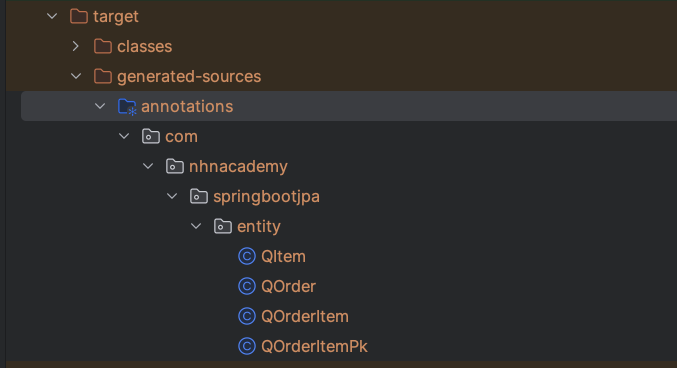
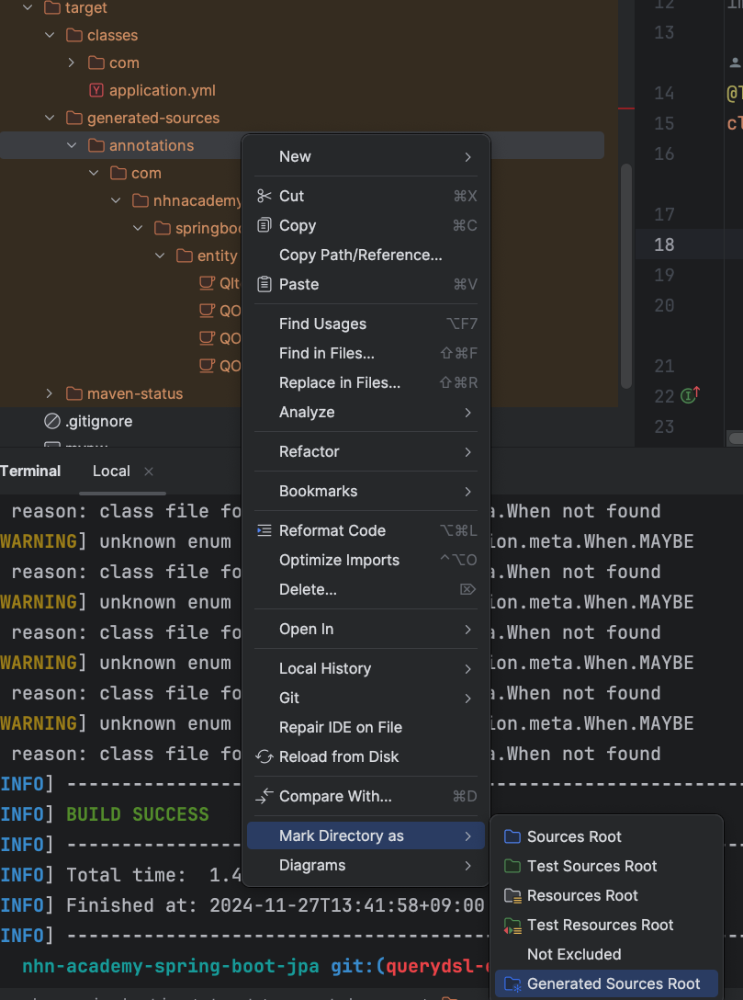

# Query DSL

디비 중심 -> jsp로 개발하다 너무 복잡한 쿼리가 나오면 QueryDsl을 사용하자

## pom.xml

스프링 부투의 버전과 잘 맞는 버전 확인하기 
```xml
        <properties>
            <java.version>21</java.version>
            <querydsl.version>5.1.0</querydsl.version>
        </properties>
 
        <dependency>
            <groupId>com.querydsl</groupId>
            <artifactId>querydsl-jpa</artifactId>
            <version>${querydsl.version}</version>
            <classifier>jakarta</classifier>
        </dependency>
        <dependency>
            <groupId>com.querydsl</groupId>
            <artifactId>querydsl-apt</artifactId>
            <version>${querydsl.version}</version>
            <classifier>jakarta</classifier>
            <scope>provided</scope>
        </dependency>
```

새로 설정하고 나서 mvn compile 다시하기
target 디렉토리 밑에 Q붙은 객체가 생김




### 에러 1. Q객체가 생겨나도 인식을 못하는 경우



annotations밑의 파일들을 사용할거라고 지정해놔야함

1. target/generated-sources/annotations 우클릭
2. Mark Directory as
3. Generated Source Root


